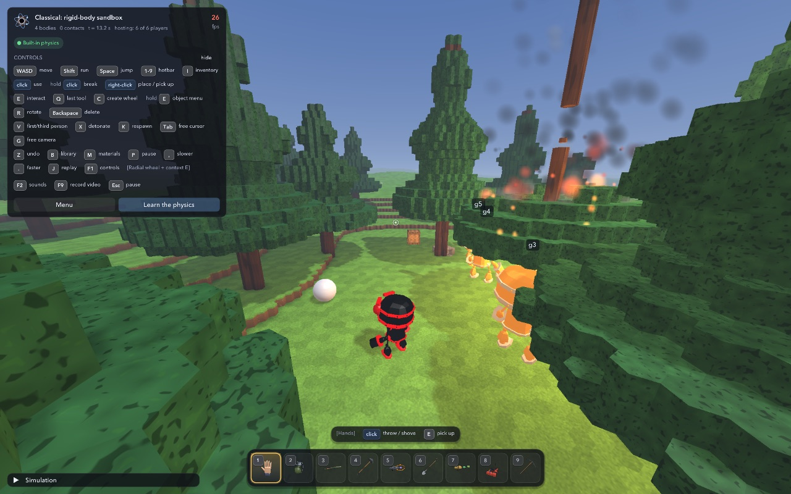
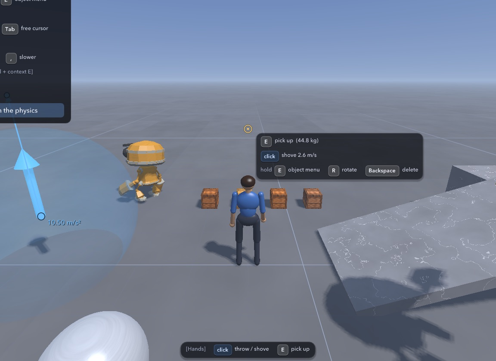
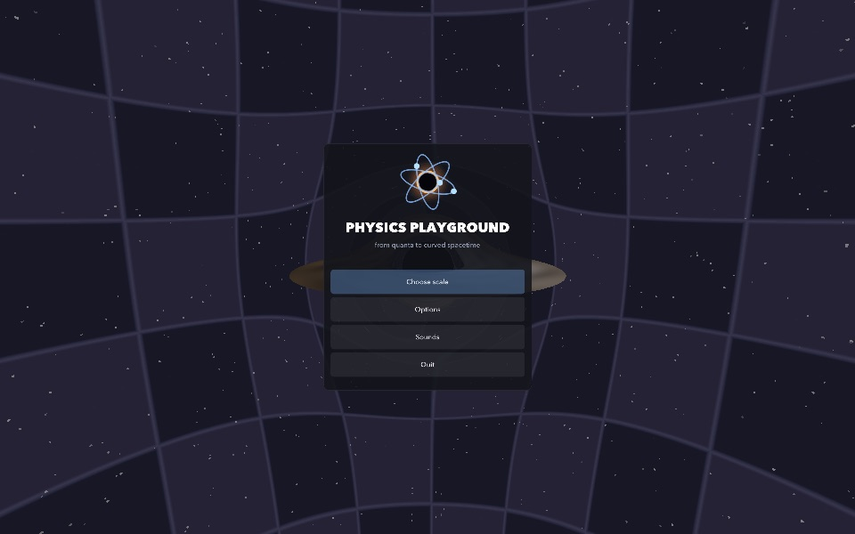

# Physics Playground

A free physics sandbox for Mac and Windows. Build with blocks and machines, drive, dig, and blow things up,
alone or with up to six players on one network. It also includes a set of smaller physics scenes, from
atoms to black holes.

## Download

| | |
|---|---|
| **Mac** (macOS 11 or later, Apple Silicon and Intel) | [PhysicsPlayground-mac.zip](https://github.com/RONIN-OP06/physics-playground/releases/latest/download/PhysicsPlayground-mac.zip) |
| **Windows** (10 or 11, 64-bit) | [PhysicsPlayground-windows.zip](https://github.com/RONIN-OP06/physics-playground/releases/latest/download/PhysicsPlayground-windows.zip) |

It is free. There is nothing to install and no account to make.

## Starting it the first time

The game is made by a hobbyist and is not registered with Apple or Microsoft, so both systems warn about it
the first time you open it. This only has to be done once.

**Mac**

1. Unzip, and drag **Physics Playground** into your Applications folder.
2. Double-click it. macOS says it could not verify the app. Click **Done**.
3. Open **System Settings > Privacy & Security**, scroll down, and click **Open Anyway** next to
   Physics Playground.

On macOS 14 or earlier: right-click the app, choose **Open**, then **Open**.

**Windows**

1. Unzip the whole folder (the program needs the folders beside it).
2. Double-click **Physics Playground.exe**. If Windows says "Windows protected your PC", click
   **More info**, then **Run anyway**.

Windows needs a graphics driver that offers OpenGL 4.1: almost any PC from the last ten years, with its
graphics driver installed.

## Playing

From the menu choose **Choose scale**, then **Classical: rigid-body sandbox**. A short tutorial starts the
first time. **F1** shows the controls, **Esc** opens the menu.

## Playing together

Up to six players can share one world.

- **Host:** in the sandbox press **Esc**, then **Open to LAN**.
- **Join:** press **Esc**, then pick the host's game under "Games on this network", or type the host's
  address and click **Join**.

Everyone needs the same version. Allow the game through the firewall (Windows) or allow it to use the local
network (Mac) when asked, or others will not be able to see you.

Friends who are not on your network can join by address through a free virtual network such as Tailscale or
ZeroTier, or if the host forwards UDP port 47815. The file PLAYING-TOGETHER.txt in the download has the
details.

## Your saves

Settings, your world and your levels are kept in your own user folder, so a newer version of the game picks
them up:

- Mac: `~/Library/Application Support/Physics Playground`
- Windows: `%APPDATA%\Physics Playground`

## Credits

Built with GLFW, Dear ImGui, ENet, cgltf, miniaudio, stb and JSON for Modern C++. The interface font is
DejaVu Sans. The robot character is "RobotExpressive" by Tomás Laulhé, with modifications by Don McCurdy
(CC0). Their licences are in THIRD-PARTY-LICENSES.txt in each download.

